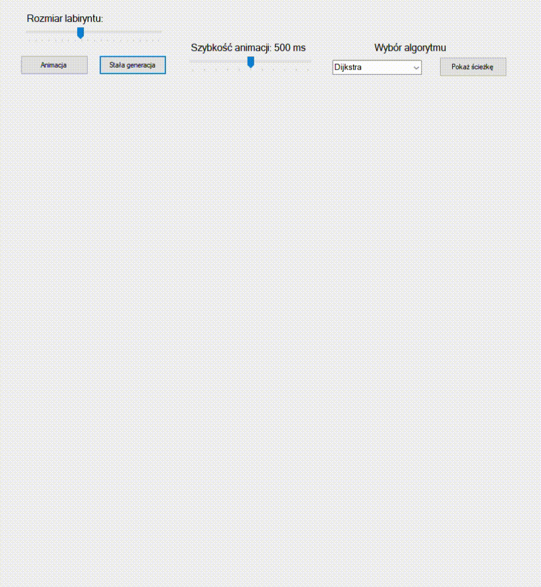

# maze-generator-csharp
Desktop application written in C#, that allows to create and visualize maze generation of various sizes, set by a user, and to find and display shortest path from left top (0,0) to bottom right (Form width, Form height) corner using different path algorithms (Dijkstra, A*, DFS, BFS). Additionaly, the animation speed can be adjusted to suit user's needs, or even disabled at all (Which means only a fully-generated maze will be rendered to the user). 

## Table of contents
* [General info](#general-info)
* [Technologies](#technologies)
* [Algorithm visualization](#algorithm-visualization)
* [Setup](#setup)

## General info
Maze generating algorithm is based on **iterative backtracking** and it can be represented by this [pseudocode](https://en.wikipedia.org/wiki/Maze_generation_algorithm):
<ol>
  <li>Choose the initial cell, mark it as visited and push it to the stack</li>
  <li>While the stack is not empty</li>
  <ol>
    <li>Pop a cell from the stack and make it a current cell</li>
    <li>If the current cell has any neighbours which have not been visited</li>
    <ol>
      <li>Push the current cell to the stack</li>
      <li>Choose one of the unvisited neighbours</li>
      <li>Remove the wall between the current cell and the chosen cell</li>
      <li>Mark the chosen cell as visited and push it to the stack</li>
      </ol>
  </ol>
</ol>

## Technologies
Project is created with:
.NET Framework 4.7.2<br>
Package OptimizedPriorityQueue 4.2.0 by [BlueRaja](https://github.com/BlueRaja/High-Speed-Priority-Queue-for-C-Sharp)<br>

## Algorithm visualization (A* example)



## Setup 

To run this project, navigate to the directory where you want to put your repository (Change the test-repo to the location where you want the cloned directory) and use:

```
cd test-repo
git clone https://github.com/piotr-rzepa/maze-generator-csharp.git
```

After that, you are able to open project in Microsoft Visual Studio and run Form1.cs to open desktop application :+1:.


